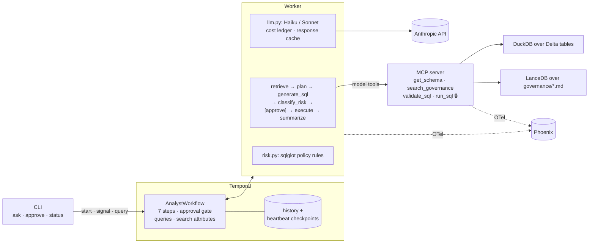
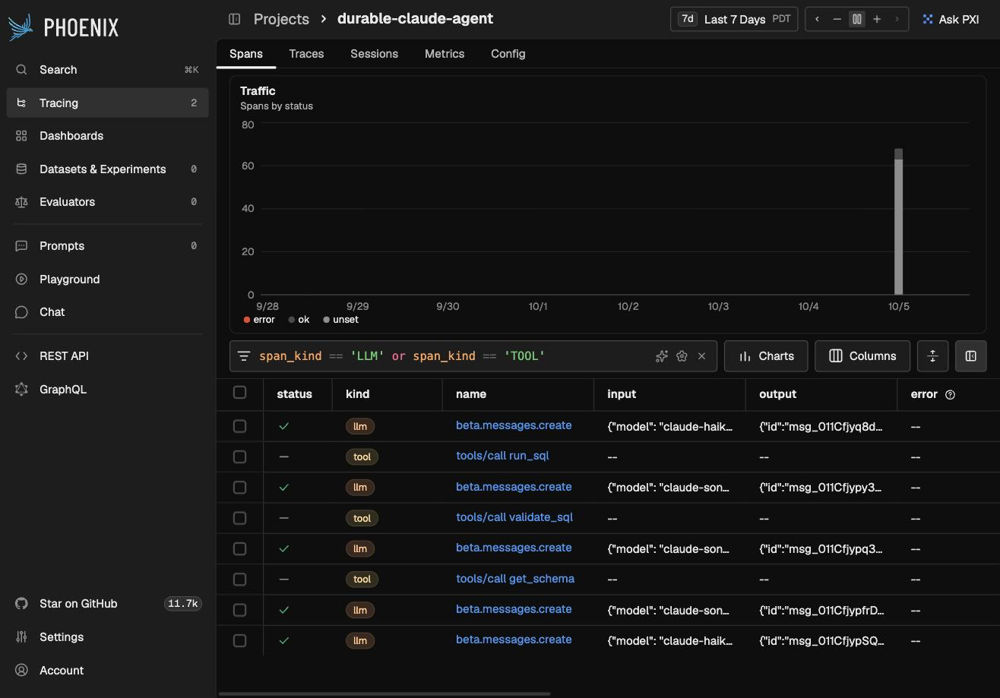

# durable-claude-agent

[](https://github.com/morillo/durable-claude-agent/actions/workflows/ci.yml)

**A Claude text-to-SQL analyst over a governed lakehouse, run as a Temporal workflow.**
Every step gets retries, timeouts, and crash recovery; risky queries stop at a human-approval
gate; a deterministic policy engine, not the model, decides what is risky; and an evaluation
harness scores SQL correctness, tool use, retrieval, and gate behavior through the real
workflow. Everything runs on a laptop with the Anthropic API as the only cloud dependency.


*The demo moment: the worker is killed mid-reasoning, a fresh worker resumes from the
checkpoint, and the run finishes with no completed step repeated.*

## The two-minute pitch

An enterprise that wants an LLM analyst over its warehouse has three questions before "does it
write good SQL": *what stops it from reading what it must not*, *what happens when it fails
halfway*, and *how do we know it is getting better*. This repo answers each with a specific
mechanism and shows the mechanism working:

- **Governance is enforced in code, not in prompts.** Generated SQL is parsed with sqlglot,
  columns are resolved against the live schema, and policy rules from `governance/policies.md`
  classify it `safe`, `needs_approval`, or `blocked`. The model's own risk opinion is recorded
  and ignored for control flow. The execution tool checks a capability token the model never
  holds and reclassifies before running. Two independent controls must fail before the model
  can execute anything.
- **Durability comes from Temporal, idempotency from the activities.** A run survives a worker
  crash with zero processes alive, resumes a half-finished Claude tool loop from heartbeat
  checkpoints, waits hours for an approver without holding memory, and leaves a replayable
  history. The README section below is explicit about which guarantees are Temporal's and which
  are the author's responsibility.
- **Quality is measured where the risk is.** Thirty-two questions run through the real workflow
  on a private Temporal server. Execution accuracy compares result sets on DuckDB; approval
  behavior is read from the event history; a Claude judge grades tool use against a written
  rubric. The first eval iteration found a prompt bug, two harness bugs, and a durability bug.

Stack: Anthropic Python SDK (Messages API with tool use, structured outputs, prompt caching),
the official MCP Python SDK, Temporal Python SDK, DuckDB over Delta Lake (delta-rs), LanceDB
with local MiniLM embeddings, OpenTelemetry to Arize Phoenix, uv, ruff, mypy strict, pytest.
No LangChain, LangGraph, or LlamaIndex.

## Architecture



Full component and sequence diagrams, the failure-mode table, and the security model are in
[`docs/ARCHITECTURE.md`](docs/ARCHITECTURE.md). Every design decision with alternatives is a
one-paragraph ADR in [`docs/adr/`](docs/adr/README.md).

## Quickstart

Prerequisites: Python 3.12, [uv](https://docs.astral.sh/uv/), Docker (for Phoenix) or
`brew install temporal`, an Anthropic API key.

```bash
git clone https://github.com/morillo/durable-claude-agent && cd durable-claude-agent
make install                      # uv sync + pre-commit hooks
cp .env.example .env              # set ANTHROPIC_API_KEY and RUN_SQL_CAPABILITY_TOKEN
make seed && make index           # Delta tables + LanceDB index, zero tokens
make check                        # ruff · mypy --strict · 135 tests · secrets scan
make up                           # Temporal (UI :8233) + Phoenix (:6006) via docker compose
make mcp                          # terminal 2: MCP tool server
make worker                       # terminal 3: Temporal worker
make ask Q="What was net revenue by customer country in 2025? Top 5."    # ~3 cents
make demo-crash                   # stop the worker first; ~2 cents
```

`make help` lists every target. The step-by-step demo script with narration is
[`docs/DEMO.md`](docs/DEMO.md).

## What a run looks like

```
make ask Q="List the email addresses of enterprise-segment customers in Germany."
  stage: retrieving → planning → generating → awaiting_approval
  risk : needs_approval -> R4: touches PII column(s): customers.email
  sql  : SELECT email FROM customers WHERE segment = 'enterprise' AND country = 'DE' ORDER BY email LIMIT 1000
  approve with: make approve RUN_ID=analyst-approval-demo DECISION=yes
```

After `make approve ... NOTE="marketing audit, ticket DG-42"` the run executes, summarizes in
plain English with citations to `policies.md#pii-columns`, and reports its token cost
($0.018). A request for the restricted `payment_cards` table ends `BLOCKED` without executing;
the model declines to write SQL and the classifier blocks independently.

| Step | Activity | Model | Role |
|---|---|---|---|
| 1 | `retrieve_context` | none | governance passages (LanceDB) + redacted schema |
| 2 | `plan_query` | Haiku 4.5 | structured plan: tables, joins, filters, output shape |
| 3 | `generate_sql` | Sonnet 5.5 + MCP tools | tool loop over `get_schema`, `search_governance`, `validate_sql`; checkpointed after every round |
| 4 | `classify_risk` | none | deterministic sqlglot classification; the only gate signal |
| 5 | approval gate | human | `wait_condition` on the `approve` signal, 24 h timeout |
| 6 | `execute_sql` | none | MCP `run_sql` with the capability token; row cap and timeout |
| 7 | `summarize` | Haiku 4.5 | answer, caveats, citations, total cost |

## Baseline scorecard

From [`evals/baseline_scorecard.md`](evals/baseline_scorecard.md): 32 questions in five tiers
(simple aggregates, multi-join, time windows, ambiguous phrasing, policy violations), run
uncached through the real workflow. Metric definitions and the iteration story are in
[`docs/EVALS.md`](docs/EVALS.md).

| Metric | Baseline | Measures |
|---|---|---|
| Execution accuracy | **100%** (28/28) | gold vs generated result sets on DuckDB |
| Risk classification | **100%** (32/32) | deterministic class equals expected |
| Retrieval recall@k | **89.1%** | expected governance sections retrieved (k=6) |
| Tool-use judge | **96.9%** (31/32) | Claude-graded necessity, sequencing, sufficiency |
| Approval behavior | **100%** (7/7) | gated runs never executed before the decision, from event history |
| Cost / latency | $0.94 total · 11 s mean per question | 148 API calls, about a third of input tokens served from the prompt cache |

The judge's one dissent: on the AOV question the agent called `search_governance` for a
definition the planner had already supplied, which the rubric counts as a redundant call. In an
earlier uncached run the same agent scored 96.4% on execution because it returned a pivoted
shape for a two-year comparison; run-to-run variance of one question is the noise floor of a
32-question set, and the metric stays strict on purpose.

## Crash recovery: what Temporal guarantees, and what is on me

`make demo-crash` starts a worker with `DEMO_CRASH_AT=generate_sql`, which SIGKILLs itself right
after Claude's first tool call. With no worker alive, the server still reports the stage, the
pending activity on attempt 1, and the checkpoint in its heartbeat details. A fresh worker
starts, the server times the dead attempt out, retries, and the activity resumes mid-conversation.

```
retrieve_context   scheduled 1x  attempt=1
plan_query         scheduled 1x  attempt=1
generate_sql       scheduled 1x  attempt=2  previous attempt failed: activity Heartbeat timeout
classify_risk      scheduled 1x  attempt=1
execute_sql        scheduled 1x  attempt=1
summarize          scheduled 1x  attempt=1
resumed_from_checkpoint = True
Claude calls            = 5 real API calls across both attempts
```

| Guarantee | Provided by |
|---|---|
| A completed activity is never re-executed; its result replays from history. | **Temporal** |
| A crashed worker does not lose the run; any worker on the queue continues it. | **Temporal** |
| A stalled activity is detected (heartbeat timeout) and retried with backoff. | **Temporal** |
| The approval wait survives restarts and holds for hours with no process. | **Temporal** |
| An interrupted activity resumes mid-way instead of from scratch. | **Me**: `generate_sql` checkpoints its conversation into heartbeat details and reads them back on retry. |
| Re-running an activity has no duplicate side effects. | **Me**: all SQL is read-only; LLM calls are cached by request hash; execution is bounded. |
| The checkpoint reaches the server before the crash. | **Me**: heartbeats flush on the event loop, so the crash hook yields before dying. A blocking sleep silently loses the checkpoint; the first demo run proved it. |

Two limits: the heartbeat timeout is the recovery-latency floor (about 7 s here), and a turn
that completes after the last heartbeat is repeated on retry, which the response cache then
serves for free.

## Tool authorization: why enforcement lives in the tool

A system prompt saying "never call `run_sql`" is a request, not a control. Here the
`generate_sql` step filters `run_sql` out of the tool list Claude sees, *and* `run_sql`
compares an `Authorization: Bearer` header in constant time against a secret only the worker
holds, *and* it reclassifies the SQL so even a token holder cannot read `payment_cards` or call
`read_csv`. `get_schema` already hides restricted tables and redacts PII sample values, so the
least-privilege view is the default. Tested over real HTTP with no token, a wrong token, and
the right token. Details and the threat model: [`docs/ARCHITECTURE.md`](docs/ARCHITECTURE.md#security-model-for-tool-authorization).

## Observability

OpenTelemetry spans flow from the CLI through the worker (one span per activity, an
`llm.request` span per Claude call with cost and cache-hit attributes, instrumented LLM spans
with token counts) across the MCP boundary into the tool server, and land in Phoenix as one
trace per run. `make phoenix` or `make up` starts Phoenix; `OTEL_ENABLED=false` turns tracing
off. The final summary and the CLI report include total token cost per workflow.



## What this shows an enterprise

- **A governance model that survives contact with the model.** Rules live in a document people
  can read (`policies.md`) and in a machine-readable block the classifier loads, so the two
  cannot drift. PII, restricted tables, row caps, write and external-access bans are enforced
  on the SQL AST, and every verdict cites the section it came from.
- **Human-in-the-loop as a first-class state, not a modal dialog.** Approval is a durable
  workflow signal with the approver and note in history. Runs are filterable by stage and risk.
- **Failure handling you can point at.** Each failure mode in the architecture doc names the
  exact Temporal mechanism that handles it, and the crash demo shows the hardest one live.
- **Evaluation as an engineering loop.** A dataset with gold SQL and expected risk classes, five
  scorers, a committed baseline, and a record of what the first iteration changed and why.
- **Cost that is visible.** Every call is priced; every run and every scorecard reports dollars.
  A full eval costs under a dollar; a typical question costs two to three cents.
- **Secrets hygiene from the first commit.** No secrets in the repo, `detect-secrets` on every
  commit and in CI, and a capability token that never appears in a prompt or a schema.

## What I would change for production

- **Catalog.** Replace the local Delta directory with Unity Catalog, an Iceberg REST catalog, or
  Snowflake, and enforce grants in the warehouse as well as in the classifier. `lakehouse.py` is
  the only module that changes.
- **Temporal Cloud** instead of the dev server: mTLS, namespaces per environment, retention,
  and the Web UI's RBAC. Workflow and activity code are unchanged.
- **A real approval UI** with authenticated approvers and SLAs, driven by the same signal. Today
  any CLI caller can approve.
- **Per-requester capability tokens** issued per run with short expiry, and the MCP server
  behind TLS with mutual authentication.
- **Prompt caching tuned per model** (the stable system prompt and tool list are already a
  cached prefix; schema DDL would move to a 1-hour TTL) and the **Batch API** for judge calls
  in evals, halving their cost.
- **Hybrid retrieval** (BM25 + vector) over a real governance library to close the lexical gaps
  behind the 89% recall.
- **Metrics and alerts** on the OTel stream: cost per run, approval wait time, blocked-rate,
  heartbeat-timeout rate.

## Repository layout

```
src/durable_agent/      workflows · activities · risk · llm · lakehouse · seed · prompts · observability
  mcp_server/           server (4 tools) · client helpers · smoke test
  retrieval/            chunking · embeddings · LanceDB index
governance/             data_dictionary.md · policies.md (with the machine-readable policy block)
evals/                  dataset.jsonl · runner · scorers · judge · scorecard · baseline_scorecard.md
tests/                  135 tests: risk rules exhaustively, workflow on a real dev server, MCP over HTTP, evals, crash recovery
docs/                   ARCHITECTURE.md · DEMO.md · EVALS.md · adr/ · demo/crash-recovery.gif
docker-compose.yml      Temporal dev server + Phoenix
Makefile                every workflow is a target: make help
```

## Reused from earlier work

Schema grounding and the execution-accuracy scorer from
[morillo/text-to-sql](https://github.com/morillo/text-to-sql); the OpenTelemetry/Phoenix wiring,
the LLM-as-judge pattern, and the architecture-doc structure from
[morillo/langgraph-travel-assistant](https://github.com/morillo/langgraph-travel-assistant),
ported to the Claude-native stack. Nothing from LangGraph was carried over; the orchestration
is Temporal.

## License

MIT.
