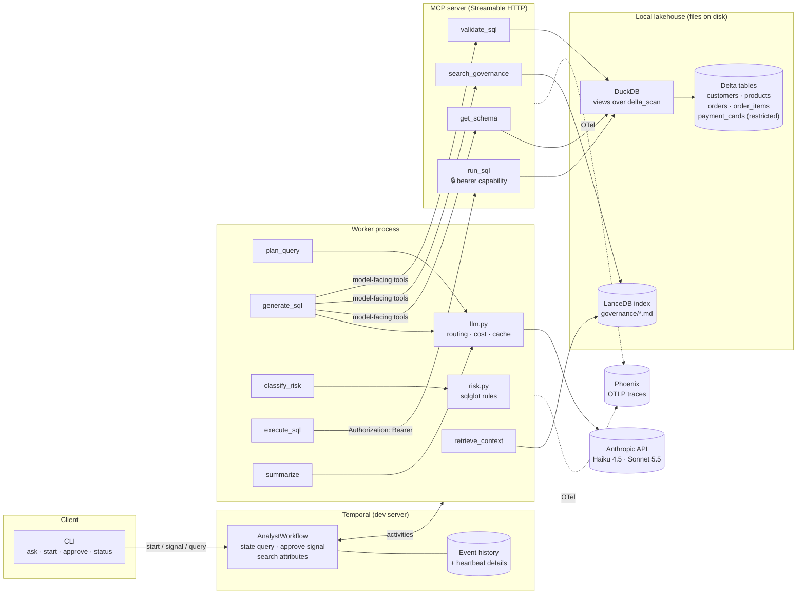

# Architecture

**Author:** Carlos Morillo · **Status:** working prototype, all milestones complete

A Claude-powered text-to-SQL analyst over a governed lakehouse, run as a Temporal workflow.
This document covers the components, the sequence of one run, the failure modes and the exact
mechanism that handles each, why Temporal and why MCP, and the security model for tool
authorization. Design decisions with alternatives are in [`docs/adr/`](adr/README.md).

## Components



| Component | Module | Notes |
|---|---|---|
| Workflow | `workflows.py` | Deterministic orchestration only. Imports models and Temporal; nothing else. |
| Activities | `activities.py` | One per step. Idempotent; `generate_sql` is resumable via heartbeat checkpoints. |
| LLM wrapper | `llm.py` | Model routing, structured outputs, refusal fallbacks, price table, request-hash response cache, OTel span per call. |
| Risk classifier | `risk.py` | Pure Python + sqlglot. Loads the rule lists from the TOML block in `governance/policies.md`. |
| MCP server | `mcp_server/` | Four tools; `run_sql` requires a capability header and reclassifies before executing. |
| Lakehouse | `lakehouse.py`, `seed.py` | DuckDB over Delta; redacted schema descriptions; bounded, interruptible execution. |
| Retrieval | `retrieval/` | Heading-scoped chunks, local MiniLM embeddings, LanceDB. |
| Observability | `observability.py` | OTel SDK + OpenInference instrumentors + Temporal tracing interceptor, exported to Phoenix. |
| Evals | `evals/` | Runs the real workflow on a private dev server; five scorers; scorecard. |

## Sequence of one run

```mermaid
sequenceDiagram
    autonumber
    participant U as Analyst (CLI)
    participant T as Temporal
    participant W as Worker
    participant M as MCP server
    participant C as Claude
    participant H as Approver

    U->>T: start AnalystWorkflow(question, requester)
    T->>W: retrieve_context
    W->>W: LanceDB top-k + redacted schema
    T->>W: plan_query
    W->>C: Haiku, structured QueryPlan
    T->>W: generate_sql (heartbeat_timeout 10 s)
    loop tool rounds (≤ 8), checkpoint after each
        W->>C: Sonnet + tool definitions
        C-->>W: tool_use get_schema / search_governance / validate_sql
        W->>M: tools/call (no credential)
        M-->>W: structured result
        W->>T: heartbeat(conversation checkpoint)
    end
    C-->>W: final {sql, explanation, self_reported_risk}
    T->>W: classify_risk (deterministic)
    alt blocked
        T-->>U: ends BLOCKED with reasons; never executes
    else needs_approval
        T->>T: wait_condition(approve signal, timeout 24 h)
        H->>T: approve(decision, note)
        alt rejected / timeout
            T-->>U: ends REJECTED / APPROVAL_TIMEOUT
        end
    end
    T->>W: execute_sql
    W->>M: tools/call run_sql (Authorization: Bearer)
    M->>M: verify token · reclassify · run with row cap + timeout
    T->>W: summarize
    W->>C: Haiku, structured Summary with citations
    T-->>U: COMPLETED: answer, SQL, risk, approval, cost
```

Stage transitions are upserted into the `AnalystStage` search attribute at every step, so the
CLI, the eval harness, and the crash demo can read progress from the server without a worker.

## Failure modes

| Failure | What happens | Mechanism |
|---|---|---|
| Claude call times out or returns 5xx / 429 | The SDK retries twice with backoff; if the activity still fails, Temporal retries it (up to 4 attempts, 2 s → 30 s backoff). Completed earlier steps are not re-run. | Anthropic SDK `max_retries`; activity `RetryPolicy`; `start_to_close_timeout` |
| Claude refuses (safety) or request is malformed | Activity fails immediately and the workflow ends `FAILED` with the reason. No retry: it will not get better. | `non_retryable_error_types` includes `LLMRefusalError`, `BadRequestError`, `AuthenticationError` |
| MCP tool error (bad SQL in `validate_sql`, DuckDB error) | Returned to the model as an `is_error` tool result so it can fix the SQL; not an activity failure. | `ToolError` → `tool_result` with `is_error` |
| MCP server unreachable | The activity fails and is retried (3 attempts); `generate_sql` resumes from its checkpoint. | `TOOL_RETRY`, heartbeat details |
| Worker crash mid `generate_sql` | Heartbeats stop; after 10 s the server times the attempt out and schedules a retry; any worker on the queue picks it up and resumes from the last checkpoint. Demo: `make demo-crash`. | `heartbeat_timeout`, `activity.heartbeat(details)`, `info().heartbeat_details` |
| Worker crash between activities | Nothing is lost: history holds every completed result. A new worker replays and continues. | Event sourcing / replay |
| Long Claude turn under load | The 3 s heartbeat pulse keeps the attempt alive during a single long call. | background `pulse()` task |
| Approval never arrives | `wait_condition` times out (24 h default); workflow ends `APPROVAL_TIMEOUT`; nothing executed. | `workflow.wait_condition(timeout=...)` |
| Approver rejects | Workflow ends `REJECTED` with the note; nothing executed. | signal handler, first decision wins |
| Policy violation in generated SQL | `classify_risk` returns `blocked`; workflow ends `BLOCKED`; `execute_sql` is never scheduled. Checked by the eval's approval metric from event history. | deterministic classifier before the gate |
| Model tries to call `run_sql` | Not in its tool list; and the server refuses without the bearer token. | filtered tool list + `ctx.headers` check |
| Caller with the token sends blocked SQL | `run_sql` reclassifies and refuses regardless of credentials. | defense in depth in the tool |
| Runaway query | Row cap (1000) via wrapped `LIMIT`, statement timeout via `interrupt()`, configuration locked. | `lakehouse.execute` |
| Duplicate API calls on retry | Identical requests served from the response cache; cache hits recorded on the span and in the usage ledger. | `ResponseCache` |

## Why Temporal

An agent step is a slow, failure-prone remote call whose result must not be lost and whose
retry must not duplicate side effects. Temporal gives each step a timeout, a retry policy, a
heartbeat, and a durable record, and it gives the whole run a replayable history and a place to
wait for a human for hours without a process holding memory. The alternative designs (a Python
loop with retries, a framework checkpointer, a queue and a state table) each rebuild part of
this by hand and keep it inside the process that can crash. The repo uses one workflow, one
task queue, and no Temporal feature beyond what the story needs. See ADR-001.

## Why MCP

The tools are the agent's only path to data, so they should be a service with a protocol, not
functions bound to one process. MCP gives a typed tool catalog, structured results, a transport
with request headers, and an ecosystem of clients (including the MCP Inspector) that can hit the
same server. It also makes the authorization boundary real: the credential for `run_sql`
travels in a header the model never sees. See ADR-002.

## Security model for tool authorization

Threat: the model, or a prompt injected through data, tries to execute SQL it should not.

1. **Least-privilege view.** `get_schema` omits restricted tables and redacts PII sample values,
   so the model does not learn what it must not touch.
2. **Model-facing tool list excludes `run_sql`.** The `generate_sql` activity filters the MCP
   catalog to `MODEL_TOOLS`. The model cannot call what it is not offered.
3. **Capability check at the tool.** `run_sql` compares `Authorization: Bearer <token>` against
   `RUN_SQL_CAPABILITY_TOKEN` with `hmac.compare_digest`. Only the worker's `execute_sql`
   activity holds the token; the model-facing session has no credential. Tested over real HTTP
   with no token, a wrong token, and the right token.
4. **Deterministic policy before the gate and again inside the tool.** `classify_risk` decides
   `safe` / `needs_approval` / `blocked` from the SQL AST and the live schema; `run_sql` repeats
   the check so a token holder still cannot read `payment_cards` or call `read_csv`.
5. **Read-only data layer.** DuckDB views over Delta cannot be written; configuration is locked;
   every query is wrapped with a row cap and interrupted at the timeout.
6. **Human in the loop for PII.** Approval is a Temporal signal recorded in history with the
   approver and note.

What this prototype does not do, and production must: authenticate the approver (today any
CLI caller can signal), scope tokens per requester and expire them, enforce grants in the
warehouse itself (Unity Catalog, Snowflake roles), and run the MCP server behind TLS with
mutual authentication.

## Observability

OpenTelemetry spans flow from the CLI (StartWorkflow), through the worker (RunActivity per
step, `llm.request` with cost and cache-hit attributes, instrumented LLM spans with token
counts), across the MCP client/server boundary (context propagated by the MCP instrumentor),
to the server's `tool.*` spans carrying the SQL and risk level. Phoenix renders one trace per
run. `make phoenix` starts it; `OTEL_ENABLED=false` turns tracing off.


